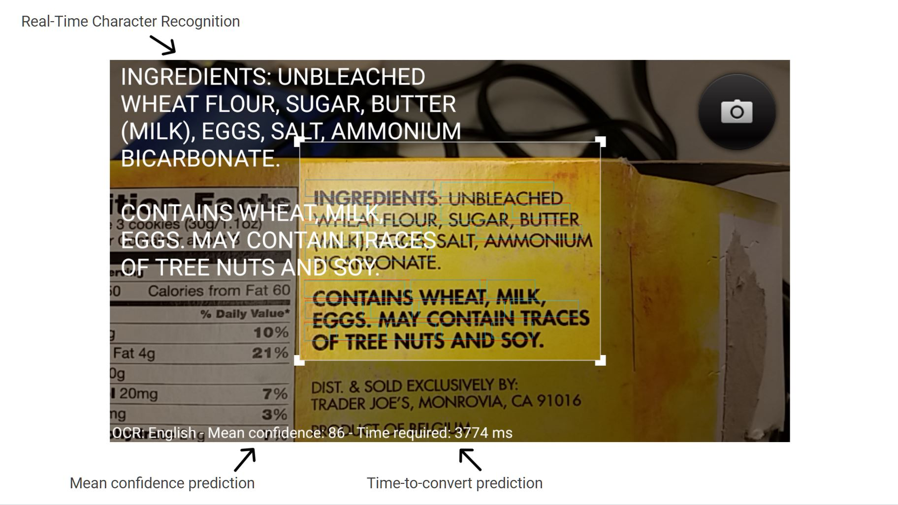

### Project Overview
TextBuddy is an Optical Character Recognition (OCR) application to simplify your life by providing the ability to convert any hard copy text into a digital file. Instantly scan desired text through the camera to the smartphone clipboard for use in any other external third-party app like messaging or email. Easily convert scanned text images or snippets of word fragments into word documents without the hassle of manually writing or typing words again.



### Motivation
The motivation behind this project was to integrate optical character recognition technology into an Android app with the ability to convert images and photographs into editable and searchable text. Instead of having to manually copy down words on paper or type text to a word document, one would be able to instantly convert fragments of text from a picture and have it automatically converted into a digital file such as a word document. In addition, one would be able to transform text in handwritten or printed text form to a digital file where it can be easily manipulated. Then one would be able to share the captured snippets through SMS or any other third-party application such as email.

OCR technology integrated with smartphone apps can instantly make the transition from hard copy to digitization without the hassle of typing the entire document again. TextBuddy’s unique capture-and-convert capability can be applied to any situation where snippets of information can be instantly shared to another person without going through manual complications. This application easily extracts words from a picture where it can be utilized and manipulated in various ways to meet the user's needs. One will be able to convert important documents, hardcopy materials, and general snippets of text into a digital format where it can be safely stored or shared.

### Implementation

The application utilizes the Tesseract Open Source OCR Engine which is essentially a large library that contains a set of Android APIs for image processing. The Tesseract engine has the capability of converting a wide range of image formats to text through trained data language files. The engine scans each character through the camera and converts it into a digital representation. Although the engine is fairly accurate at recognizing and converting printed documents, the engine loses accuracy if scanned on handwritten words. Through the OCR engine, we implemented character recognition with features such as window size adjustment, real-time character recognition, camera autofocus, mean-confidence prediction, and time-to-convert prediction. 

Through the interface, the user is able to adjust the size of the scanner window to extract desired text. As the user adjusts the window and scans text, real-time character recognition feedback is fed to the interface after the text is converted by the engine. In conjunction with real-time character recognition, the predicted accuracy of the scanned text is displayed as well as the predicted time needed to convert the physical text into a digital file. 

### Learning Outcomes
By implementing this app, we learned how to work with the android interface by experimenting with widgets provided by Android studio. We also experimented with the library which included testing the APIs to see how it interacted with the engine which led to the implementation of various features. For instance, instead of hiding the conversion process in the background, character conversion was extracted from the APIs and displayed on the interface which led to the real-time character recognition feature. In addition to learning about library integration with Android Studio, we learned about the activity lifecycle, camera operation, and basic Android features such as the clipboard. 

Source: <a href="https://github.com/nathancy/TextBuddy" target="_blank"><i class="large github icon"></i>https://github.com/nathancy/TextBuddy</a> 

