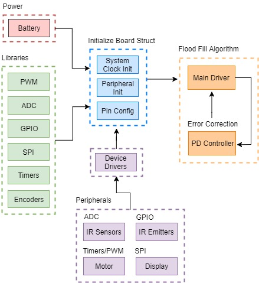
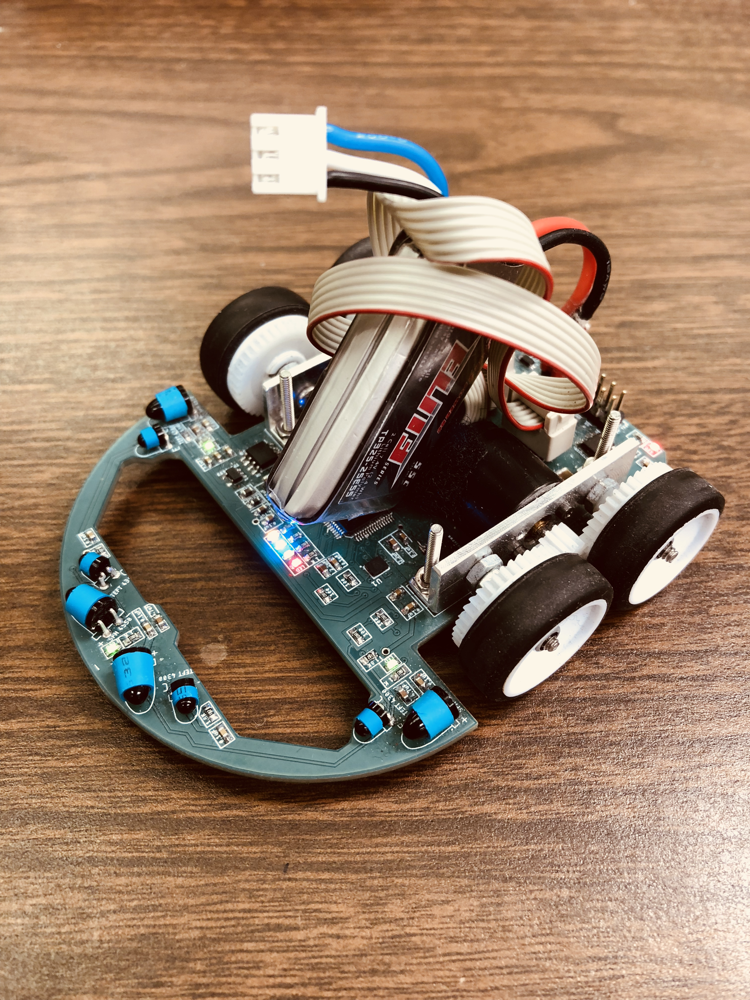

### Project Overview
A micromouse is a small robotic vehicle designed to navigate its way through an unknown maze. It is an autonomous, battery-operated, and self-contained robot that utilizes maze-solving algorithms to find the optimal route with the shortest run time to the center of the maze. The main challenge is to equip the electro-mechanical device with adaptive intelligence which enables the exploration of different maze configurations. In addition, the mouse must reliability navigate through the maze at accelerated speeds without crashing into the maze walls. The three main subsystems consist of the drive system, control system, and sensors. The drive system includes a mechanical chassis, a set of motors, gears, and wheels which enables the mouse to maneuver within the constraints of the maze. The control system utilizes a maze-solving algorithm based on sensor readings to calculate the fastest possible path. The final subsystem is the sensors which relays the current state of the surroundings and assists in wall detection. By combining these components, an autonomous mouse capable of navigating through a maze was designed, built, and programmed.



### Block Diagram

### Parts
* Flash Mode Switch Button: [KMR211G](https://www.digikey.com/product-detail/en/c-k/KMR211GLFS/401-1426-1-ND/550461)
* Power Distribution Switches: [ULN2003APWR](https://www.digikey.com/product-detail/en/texas-instruments/ULN2003APWR/296-27173-1-ND/2255408)
* Buzzer: [SMT-0540-S-R](https://www.digikey.com/product-detail/en/pui-audio-inc/SMT-0540-S-R/668-1060-1-ND/1464927)
* Diode-Rectifier: [1N4148WX](https://www.digikey.com/product-detail/en/micro-commercial-co/1N4148WX-TP/1N4148WXTPMSCT-ND/717312)
* Sensor (IR Emitter): [SFH4545](https://www.digikey.com/product-detail/en/osram-opto-semiconductors-inc/SFH-4545/475-2919-ND/2205955)
* Sensor (IR Receiver): [TEFT4300](https://www.digikey.com/product-detail/en/vishay-semiconductor-opto-division/TEFT4300/751-1041-ND/1681175)
* Gyroscope: [LSM6DS3USTR](https://www.digikey.com/product-detail/en/stmicroelectronics/LSM6DS3USTR/497-16910-1-ND/6229964)
* LED Display: [HCMS-2903](https://www.digikey.com/product-detail/en/broadcom-limited/HCMS-2903/516-1173-5-ND/637437)
* Voltage Regulator (5V): [TPS76850QDR](https://www.digikey.com/product-detail/en/texas-instruments/TPS76850QDR/296-46396-1-ND/7033570)
* Voltage Regulator (3.3V): [TPS73633DBVR](https://www.digikey.com/product-detail/en/texas-instruments/TPS73633DBVR/296-27064-1-ND/2255336)
* Slide Switch: [TS02_Switch](https://www.digikey.com/product-detail/en/c-k/TS02CBE/CKN9924-ND/2055202)
* PMIC - Gate Drivers: [TC4427](https://www.digikey.com/product-detail/en/microchip-technology/TC4427AEUA713/TC4427AEUA713CT-ND/7671944)
* Motor Driver: [ZXMHC3F381N8](https://www.digikey.com/product-detail/en/diodes-incorporated/ZXMHC3F381N8TC/ZXMHC3F381N8DICT-ND/2095683)
* STM Processor: [STM32F405RGT6](http://www.st.com/en/microcontrollers/stm32f405rg.html)
* STM Programmer: [STMicroelectronics ST-LINK/V2](https://www.digikey.com/product-detail/en/ST-LINK%2FV2/497-10484-ND/2214535?curr=usd&WT.z_cid=ref_octopart_dkc_buynow&site=us)
* Motor: [1717T006SRIE2-1024](https://www.micromo.com/1717t006srie2-1024.html)
* Diode-Rectifier: [MBR120VLSFT](https://www.digikey.com/products/en?KeyWords=MBR120VLSFT3GOSCT-ND&WT.z_header=search_go)
* Venom Fly Lipo Battery: [120mAh 7.4V 30C 2S1P](https://www.amazon.com/Venom-300mAh-Battery-flite-Combo/dp/B016ZM3CVA/ref=sr_1_10?s=toys-and-games&ie=UTF8&qid=1506392180&sr=1-10&keywords=7.4V+JST)
* PCB Fabrication: [Advanced Circuits](http://www.4pcb.com/) 

Source: <a href="https://github.com/joshuaccl/Micromouse" target="_blank"><i class="large github icon"></i>https://github.com/joshuaccl/Micromouse</a>

Video demo: <a href="https://www.youtube.com/watch?v=v6TXTJd9zPE" target="_blank"><i class="large youtube icon"></i>https://www.youtube.com/watch?v=v6TXTJd9zPE</a>